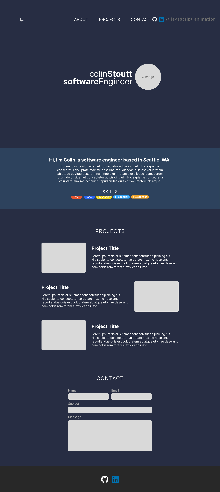
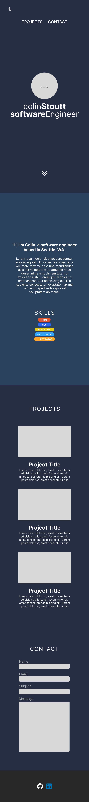

# Colin Stoutt: Porfolio

## Wireframes

---

## Outline of content

---

### About section

Where I'm from, a brand statment of some kind.
Relevent skills

### Projects section

A z-grid layout of my projects with titles and descriptions explaing what the project is, why I did it, and what technologies were used.

### Contact section

This will be a functional contact form that will send an email straight to my account.
If I can't get this to work I will create a card with my contact information.

Add clickable logo links to both my Github and my LinedIn.

## Technologies used

---

HTML

CSS

JS

## API's/outside resources

---
