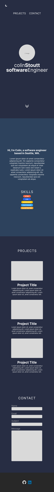

# Porfolio

## Project Schedule

| Day   | Deliverable                                  | Status     |
| ----- | -------------------------------------------- | ---------- |
| Day 1 | Project Description                          | Complete   |
| Day 2 | Wireframes / Priority Matrix / Timeline      | Complete   |
| Day 3 | Core Application Structure (HTML, CSS, etc.) | Complete   |
| Day 4 | MVP & Bug Fixes                              | Incomplete |
| Day 5 | Final Touches                                | Incomplete |
| Day 6 | Present                                      | Incomplete |

## Wireframes




## Time/Priority Matrix

#### MVP

| Component               | Priority | Estimated Time | Actual Time |
| ----------------------- | :------: | :------------: | :---------: |
| Project Previews        |    H     |      3hr       |     hr      |
| Regular Nav             |    H     |     30min      |     1hr     |
| Other sections and flex |    M     |      3hr       |     3hr     |
| Javascript animation    |    H     |      3hr       |     1hr     |
| Responsive              |    H     |      3hr       |     3hr     |
| Social Media Icons      |    L     |      1hr       |     1hr     |
| Total                   |    H     |    13.5hrs     |     hrs     |

#### PostMVP

| Component            | Priority | Estimated Time | Actual Time |
| -------------------- | :------: | :------------: | :---------: |
| Dark mode/light mode |    L     |      3hr       |     hr      |
| Direct Contact form  |    H     |      3hr       |     DNF     |
| Hover effects        |    L     |     40min      |     1hr     |
| TOTAL                |    L     |    10.10hr     |     hr      |

## Outline of content

### Nav

Three anchor tags. About, Projects, and Contact.

The contact link will have two social logos animate out from the side on hover.

If I have time I will try to impliment a dark mode/light mode switch.

### About section

Where I'm from, a brand statment of some kind.
Relevent skills

### Projects section

A z-grid layout of my projects with titles and descriptions explaing what the project is, why I did it, and what technologies were used.

Each preview will link directly to its github repo.

### Contact section

This will be a functional contact form that will send an email straight to my account.
If I can't get this to work I will create a card with my contact information.

Add clickable logo links to both my Github and my LinedIn.

## Technologies used

HTML

CSS

JS

## Additional Libraries Used

## Code Snippet

Use this section to include a brief code snippet of functionality that you are proud of an a brief description

```
function myCoolThing() {
	// here is the code to do something really cool!
```

## Issues and Resolutions

Use this section to list of all major issues encountered and their resolution.
